# ***Demoblaze_Python_Final_Project***

## **⚡ OVERVIEW **

* This is a Final project on "Demoblaze" Website testing
* In this project I have done Automation testing using Python Selenium and I used Excel to make manual testing.

### 🔑 KEYWORDS:

>* Python = is a popular programming language.
>* Pytest = is a command-line tool that automatically finds tests you've written, runs the tests, and reports the results.
>* Allure = is a flexible lightweight multi-language test report tool that not only shows a very concise representation of what have been tested in a neat web report form, but allows everyone participating in the development process to extract maximum of useful information from everyday execution of tests.
>* Selenium = is a powerful tool for controlling web browsers through programs and performing browser automation.
>* API =  is an abbreviation for Application Programming Interface which is a collection of communication protocols and subroutines used by various programs to communicate between them.
>* POM (Page Object Model) = is a design pattern which is commonly used in Selenium for Automating the Test Cases. This design pattern can be used with any kind of framework like keyword-driven, Data-driven, hybrid framework, etc.
>* __init__.py file = is a file that is used to mark a directory as a Python package. Every directory that contains code that you want to be able to import as a simple Python package needs to contain an __init__.py. 
>* allure.severity = In allure, we can define any @Test with @Severity annotation with any of these values like BLOCKER, CRITICAL, NORMAL, MINOR, TRIVIAL. By looking at this, we can understand the Severity of test if Failed.
>* allure.description = are detailed description for each test method.
>* allure.attach = An attachment in Java code is simply a method annotated with @Attachment that returns either a String or byte[], which should be added to the report.
>* allure.step = are any actions that constitute a testing scenario. Steps can be used in different testing scenarios.
>* pytest.mark = are used to set various features/attributes to test functions.
>* pytest.fixture = are functions that can be used to manage our apps states and dependencies.
>* Assertion = are statements that you can use to set sanity checks during the development process.
>* Window alert = it instructs the browser to display a dialog with an optional message, and to wait until the user dismisses the dialog.
>* Time.sleep = is used to add delay in the execution of a program.
>* implicitly_wait = sets a sticky timeout to implicitly wait for an element to be found, or a command to complete.
>* execute_script = The commands to be executed are passed as arguments to the method. Some operations like scrolling down in a page cannot be performed by Selenium methods directly
>* Jenkins = is an open source automation server which enables developers around the world to reliably build, test, and deploy their software.

## 🚧 About The project
>* This project is Build in Python programming language using POM and have Multiple class and directory's. 
>* > ABOUT "Demoblaze"
   >-- We believe performance needs to be validated at every stage of the software development cycle and our open source compatible, massively scalable platform makes that a reality.
>* To start this website it will ask the Username and password to enter the 
>* There are 3 categorises found in this website these are Phone, Laptops and Monitors.
>* In each catagory we have different products and models found which the user can add them to the cart.
>* From this website after the user login successfully user select the products and add them to cart. and by filing the all details on place order form and purchases products.
>* This project consist of 2 main directory's these are WEB and API.
>* In the Web directory there are 5 subdirectories and in the API directory there are 2 subdirectories
>* This website has 6 components which needed to be checked this are (Home, Contact, About, Cart, Login , SignUp)
>* To run the test or tested by selenium testing tool and pytest
>* For making reporting I used Allure reporting technique 

## 📈 Diagram 
* The General Flow Chart Diagram for the Overall Project
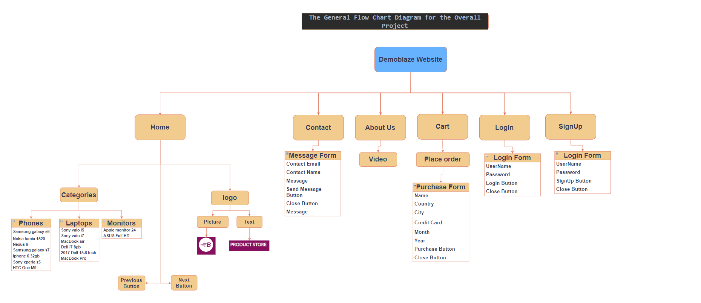

## 📸 Screenshot 
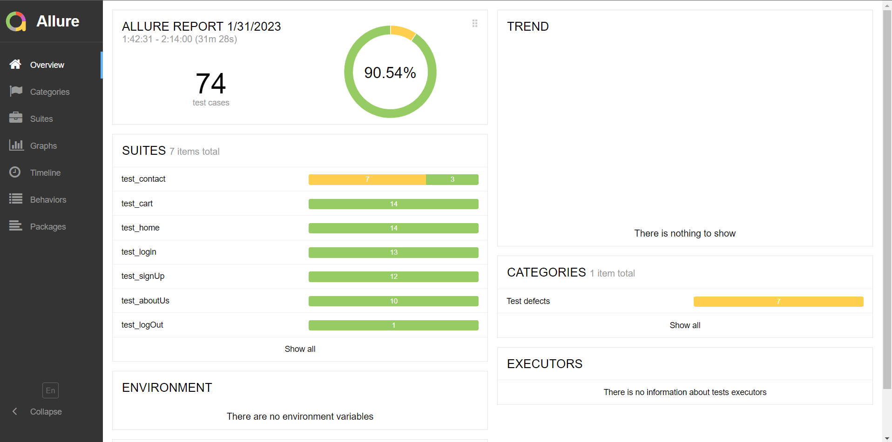
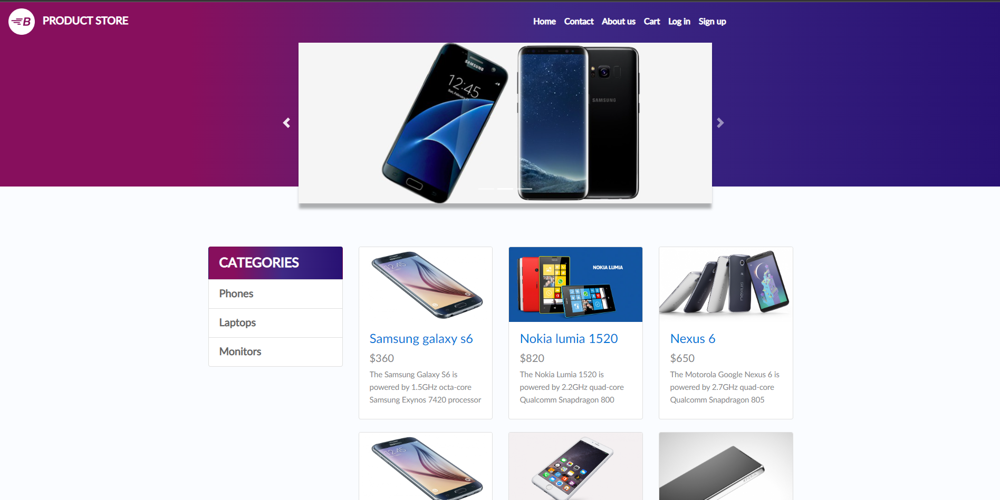
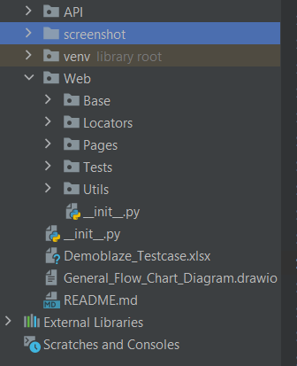
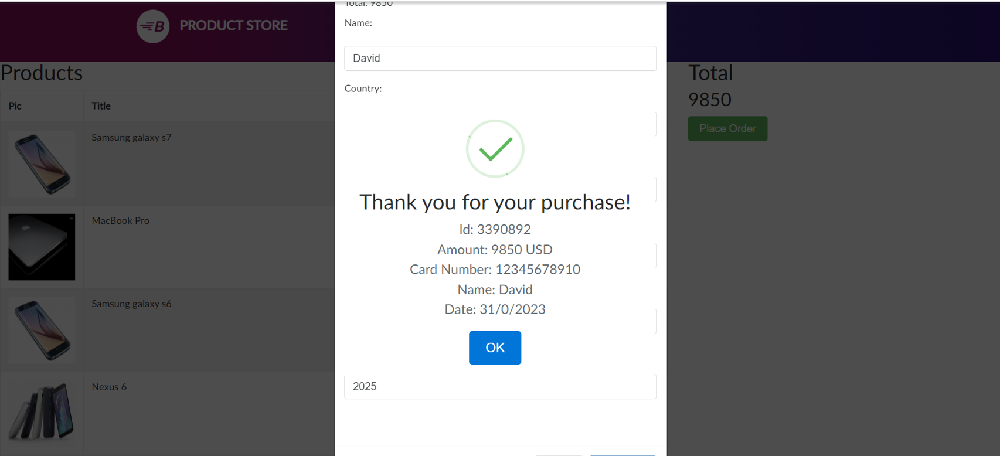
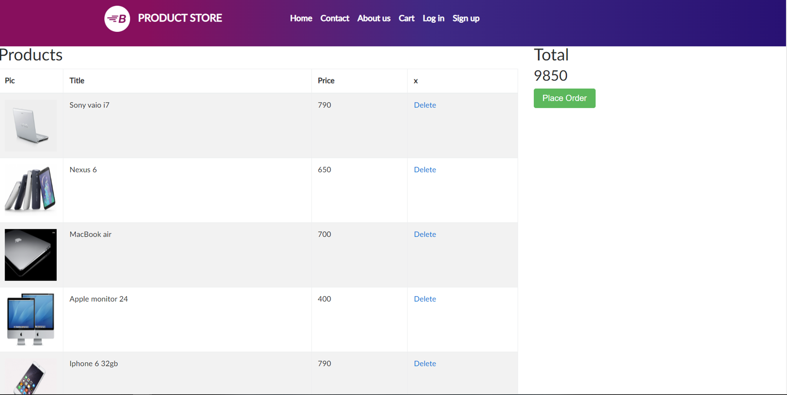
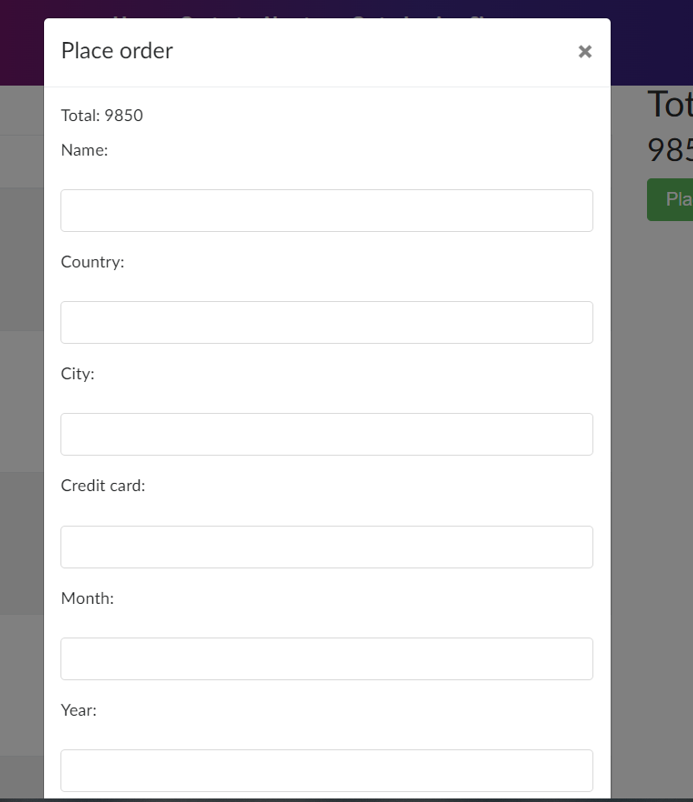
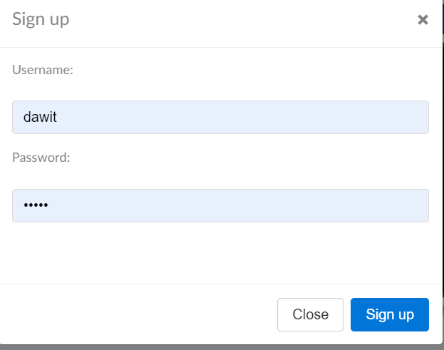
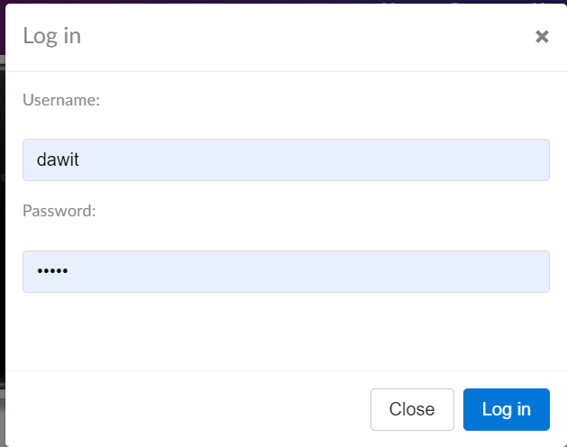
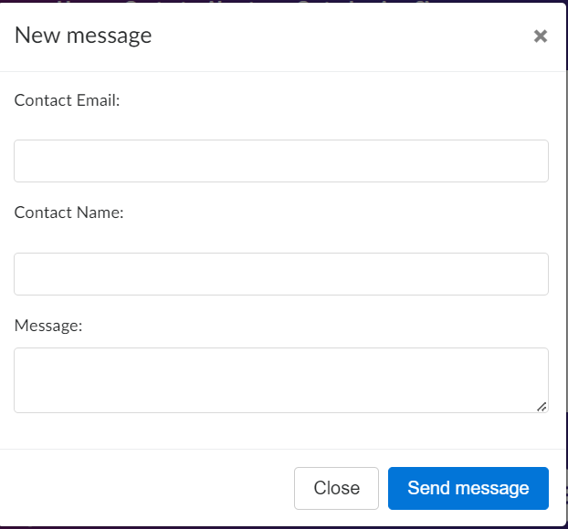
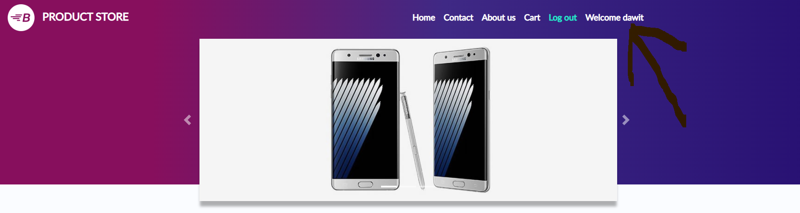

## ⚙ Usage
* Open Pycharm Community Edition 
* Open Pycharm terminal
* Navigate the absolute value of the tests
* Run tests in a module using pytest test_mod.py.
* To enable Allure listener to collect results during the test execution simply add --alluredir option and provide path to the folder where results should be stored. 
* > E.g.: pytest --alluredir=/tmp/my_allure_results
* To see the actual report after your tests have finished, you need to use Allure commandline utility to generate report from the results.
* > E.g.: allure serve /tmp/my_allure_results

  
# 🛠️ Project Tools and Packages Used

>On this final Project packages used are
>- Pytest
>- Selenium
>- Webdriver-manager
>- Request
>- Allure
>- Time

>On this final Project Tools and Techniques used are
>- Python Functions
>- Python Arrays
>- Python Conditions
>- Page Object Model (POM)

# 💻 Source
- Pycharm software
- GitHub 
- Jenkins
- Allure
- Google Chrome
- Geeksforgeeks
- W3schools

### 🙌☺️️☺️🙌  Thank you!!!    🙌☺️️☺️🙌
